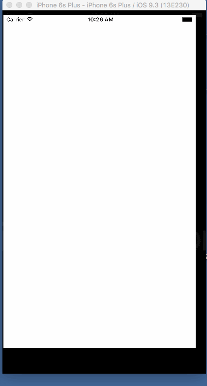

# ProgressViewExample

仿App Store下载进度圆环



# Usage

```
+ (ProgressView *)initWithRadius:(CGFloat)radius side:(CGFloat)side color:(UIColor *)color;
```

radius 外圆环大小

side 正方形边长

color 圆环颜色


```
-(void)setProgress:(CGFloat)progress;
```

设置进度

```
@protocol ProgressViewDelegate <NSObject>
@required
-(void)progressViewFinish;
@end
```

圆环加载完毕回调方法
